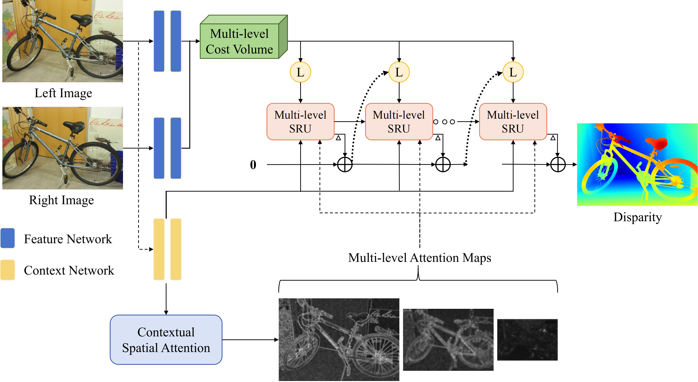

# Selective-Stereo (CVPR 2024 Highlight)

This repository contains the source code for our paper: 

[Selective-Stereo: Adaptive Frequency Information Selection for Stereo Matching](https://openaccess.thecvf.com/content/CVPR2024/papers/Wang_Selective-Stereo_Adaptive_Frequency_Information_Selection_for_Stereo_Matching_CVPR_2024_paper.pdf)

CVPR 2024 Highlight

Xianqi Wang, Gangwei Xu, Hao Jia, Xin Yang

```
@inproceedings{wang2024selective,
  title={Selective-stereo: Adaptive frequency information selection for stereo matching},
  author={Wang, Xianqi and Xu, Gangwei and Jia, Hao and Yang, Xin},
  booktitle={Proceedings of the IEEE/CVF Conference on Computer Vision and Pattern Recognition},
  pages={19701--19710},
  year={2024}
}
```



## Demo

Pretrained models can be downloaded from [Google Drive](https://drive.google.com/drive/folders/1HwwGicI9f_WWOdjh3t5l6l4cn64zr_V5?usp=sharing).

To evaluate SceneFlow, run

```
python evaluate_stereo.py --restore_ckpt ./pretrained_models/sceneflow.pth
```

To predict Middlebury, run

```
python demo_imgs.py --restore_ckpt ./pretrained_models/middlebury_finetune.pth --valid_iters 80 --max_disp 768
```

# Environment

```
conda create -n Selective_Stereo python=3.8
conda activate Selective_Stereo

pip install torch torchvision
pip install tqdm timm==0.5.4
pip install opencv-python scikit-image matplotlib
pip install opt_einsum
```

# Required Data

* [SceneFlow](https://lmb.informatik.uni-freiburg.de/resources/datasets/SceneFlowDatasets.en.html)
* [KITTI](https://www.cvlibs.net/datasets/kitti/eval_scene_flow.php?benchmark=stereo)
* [ETH3D](https://www.eth3d.net/datasets)
* [Middlebury](https://vision.middlebury.edu/stereo/submit3/)
* [TartanAir](https://github.com/castacks/tartanair_tools)
* [CREStereo Dataset](https://github.com/megvii-research/CREStereo)
* [FallingThings](https://research.nvidia.com/publication/2018-06_falling-things-synthetic-dataset-3d-object-detection-and-pose-estimation)
* [InStereo2K](https://github.com/YuhuaXu/StereoDataset)
* [Sintel Stereo](http://sintel.is.tue.mpg.de/stereo)
* [HR-VS](https://drive.google.com/file/d/1SgEIrH_IQTKJOToUwR1rx4-237sThUqX/view)

# Training

To train on SceneFlow, run

```
python train_stereo.py --logdir ./checkpoints/sceneflow
```

To train on KITTI, run

```
python train_stereo.py --restore_ckpt ./pretrained_models/sceneflow.pth --train_datasets kitti --num_steps 50000
```

To train on ETH3D, run

```
python train_stereo.py --restore_ckpt ./pretrained_models/sceneflow.pth --train_datasets eth3d_train --num_steps 300000 --image_size 384 512
python train_stereo.py --restore_ckpt ./pretrained_models/eth3d_train.pth --tarin_datasets eth3d_finetune --num_steps 90000
```

To train on Middlebury, run

```
python train_stereo.py --restore_ckpt ./pretrained_models/sceneflow.pth --train_datasets middlebury_train --num_steps 200000 --image_size 384 512
python train_stereo.py --restore_ckpt ./pretrained_models/middlebury_train.pth --tarin_datasets middlebury_finetune --num_steps 100000 --image_size 384 768 --max_disp 768
```
